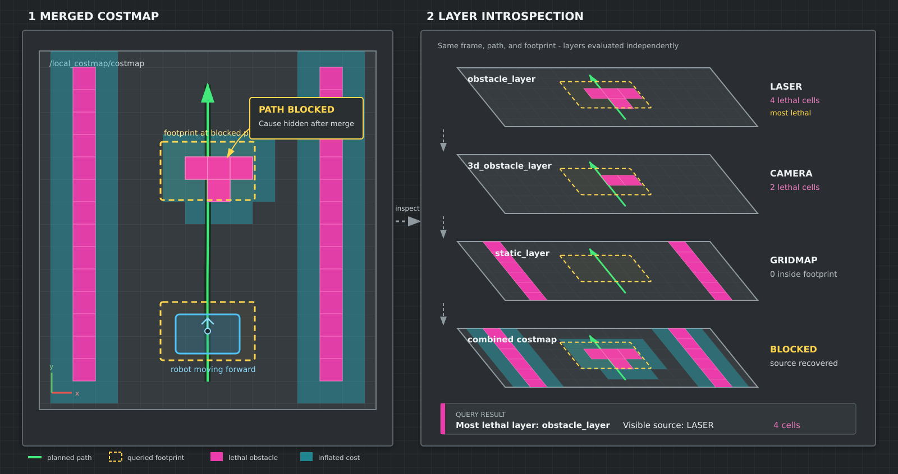

# costmap-inspector

A Nav2 costmap plugin for identifying which costmap layer is responsible for
lethal cells in a queried area. This allows to figure out **what** blocks a planned path for a robot.



The overview shows how a merged costmap can be inspected by querying a
footprint against its individual layers, making the source of lethal cells
visible.


This package was built for ROS 2 Humble.

## Functionality

`costmap_inspector::LayerInspector` inspects the individual layers of a layered
costmap without modifying the master costmap. It can:

- Query a polygon footprint against every enabled and current costmap layer.
- Count lethal cells per layer and report the layer with the highest count.
- Use either the configured Nav2 costmap footprint or a footprint supplied in
  the request.
- Transform the queried footprint into the costmap frame using TF.
- Persist recently detected lethal layer names for a configurable timeout.
- Publish the lethal cells as a `sensor_msgs/msg/PointCloud2`.
- Optionally publish the checked footprint and individual layers as debug topics.

## Plugin configuration

Add the plugin to the layered costmap's plugin list. The plugin does not add
costs to the master costmap, so it can be placed after the layers it inspects.

```yaml
costmap:
  costmap:
    ros__parameters:
      plugins: ["obstacle_layer", "inflation_layer", "inspector_layer"]

      inspector_layer:
        plugin: "costmap_inspector::LayerInspector"
        enabled: true
        query_result_topic: costmap/inspector_layer/query_result
        lethal_points_topic: costmap/inspector_layer/lethal_points
        query_service: costmap/inspector_layer/polygon_query
        base_frame: base_link
        lethal_layers_timeout_seconds: 0.5
        debug.publish_checked_footprint: false
        debug.publish_individual_layers: false
        debug.publish_individual_layers_periodically: false
        debug.publish_periodically_period_seconds: 1.0
```

The layer also supports mapping costmap layer names to human-readable obstacle
sources with `source_names.sources`, `source_names.<source>.name`, and
`source_names.<source>.layers` parameters.

## Query interface

The service is exposed at:

```text
/costmap/inspector_layer/polygon_query
```

Service type: `costmap_inspector_msgs/srv/CostmapQuery`.

The request contains:

- `use_costmap_footprint`: use the costmap's configured footprint when true.
- `footprint`: the polygon to query when `use_costmap_footprint` is false.
- `footprint_pose`: pose and frame used to place the footprint.
- `persist_result`: retain layers containing lethal cells for the configured
  timeout.

The service only acknowledges that the request was added to the processing
queue. Results are published asynchronously on:

```text
/costmap/inspector_layer/query_result
```

Message type: `costmap_inspector_msgs/msg/CostmapQueryData`. Results include
the number of cells in the polygon, per-layer lethal-cell counts, the most
lethal layer, the mean distance and angle of detected lethal cells, and any
persisted layer or source names. The result status is one of:

- `RESULT_NO_LETHAL_DATA`
- `RESULT_LETHAL_DATA`
- `RESULT_PERSISTED_LETHAL_DATA`
- `RESULT_FAILURE`

## Published topics

- `/costmap/inspector_layer/lethal_points` (`sensor_msgs/msg/PointCloud2`)
- `/costmap/costmap` (`nav_msgs/msg/OccupancyGrid`)
- `<layer-name>/checked_footprint` (`geometry_msgs/msg/PolygonStamped`) when
  `debug.publish_checked_footprint` is enabled
- `<layer-name>/debug/<costmap-layer>` (`nav_msgs/msg/OccupancyGrid`) when
  individual-layer debug publishing is enabled

## Build and test

Build the packages in a ROS 2 workspace with `colcon`:

```bash
colcon build \
  --packages-select costmap_inspector_msgs costmap_inspector \
  --cmake-args -DBUILD_TESTING=ON
source install/setup.bash
colcon test \
  --packages-select costmap_inspector \
  --event-handlers console_direct+ \
  --ctest-args -V
```

The service and message definitions are provided by the companion
`costmap_inspector_msgs` package.

## Example


The `costmap_inspector_example` package starts a standalone local costmap with:

- A 5 m x 5 m rolling costmap at 0.05 m resolution.
- A centered 5 m x 5 m static map and static TF transforms from `map` to
  `laser_frame`.
- Static, obstacle, inflation, and inspector layers.
- A fake laser scan with one moving obstacle. The obstacle moves around the
  robot over 60 seconds and publishes at 10 Hz with 0.25 degree resolution.
- A query node that submits a random footprint query every 2 seconds and logs
  the asynchronous inspector result.
- Debug layers are enabled (here shown laser: orange, static map: cyan) and lethal points are published (blue)

The launch file configures and activates the standalone costmap automatically.
The main interfaces are:

- Query service: `/costmap/inspector_layer/polygon_query`
- Query results: `/costmap/inspector_layer/query_result`
- Lethal points: `/costmap/inspector_layer/lethal_points`
- Published costmap: `/costmap/costmap`
- Fake scan: `/scan`

The fake scan can be disabled or its orbit period changed with launch
arguments:

```bash
ros2 launch costmap_inspector_example costmap_inspector_demo.launch.py \
  publish_fake_scan:=false \
  fake_scan_motion_period:=120.0
```
